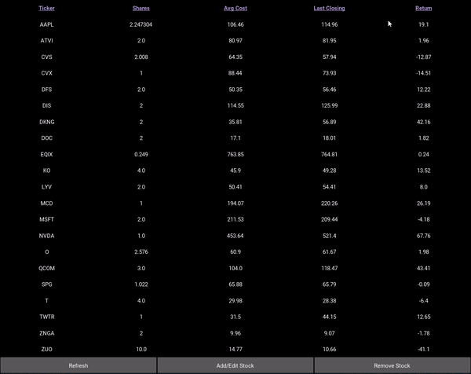
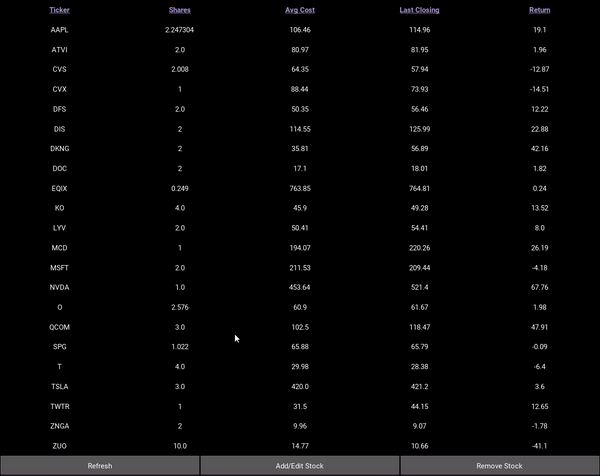

<b>Project Inspiration</b>

This project was inspired by a popular brokerage application, Robinhood. The goal of this project
was to see if I could recreate a similar user experience with some additional features.

<b>Files</b>

stock.py
  is a file that stores a Stock class and a StockPortfolio class

main.py is where the application is run
  this file contains the logic used to create the UI

stockProtfolio.json
  the users stock portfolio is stored in this file
  the current file has an example of what an indiviual's stock portfolio would look like (this my personal portfolio!)

<b>Future Implementation</b>

For future features, I want to add dividened history details about companies, something Robinhood does not provide.
In addition, I want to add graphs to plot a stocks price history

<b> Current Features</b>

<b>Refresh Stock</b>

<b>Add/Edit Stock</b>

<b>Remove Stock</b>

<b>Stock Button</b>

