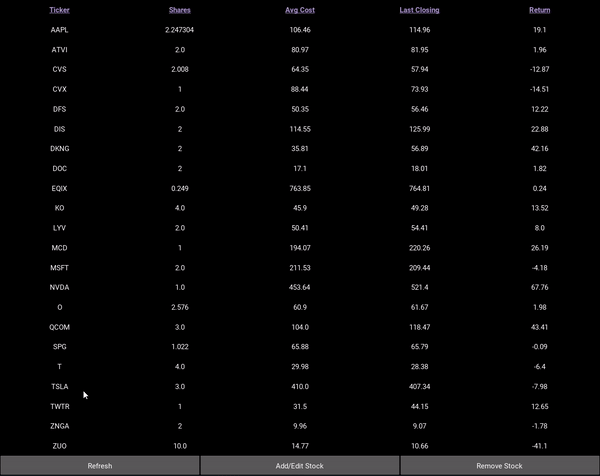
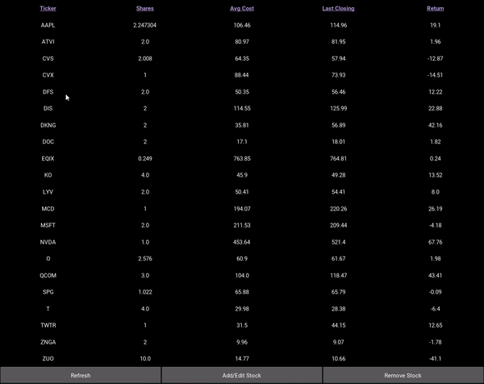

stock.py
  is a file that stores a Stock class and a StockPortfolio class

main.py is where the application is run
  this file contains the logic used to create the UI

stockProtfolio.json
  the users stock portfolio is stored in this file
  the current file has an example of what an indiviual's stock portfolio would look like (this my personal portfolio!)

Refresh Stock

Add/Edit Stock

Remove Stock

Stock Button

